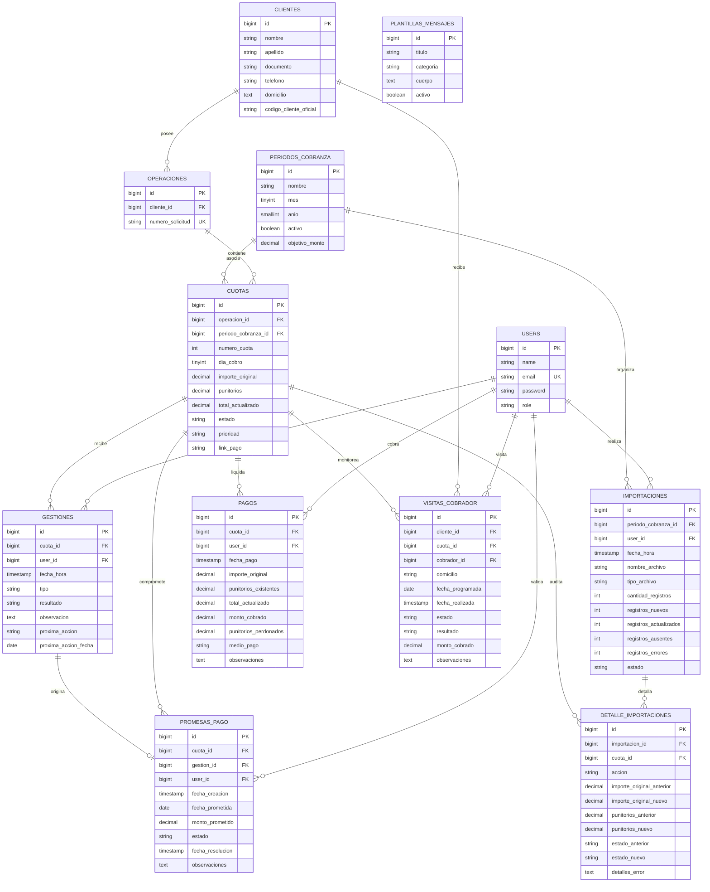

# Diseño del Modelo de Datos — Gestor de Cobranzas

Este documento describe el diseño detallado de la base de datos relacional para el **Gestor de Cobranzas**, estructurado para garantizar la integridad de los datos, la separación clara entre los datos oficiales y los de gestión, un historial de cambios auditable y una sincronización robusta ante importaciones sucesivas de carteras.

---

## 1. Objetivo

El objetivo de este diseño es establecer una estructura de base de datos relacional normalizada y optimizada para la aplicación "Gestor de Cobranzas". Esta base de datos permitirá:
*   Administrar clientes, operaciones (créditos) y cuotas sin duplicados.
*   Importar carteras mensuales y realizar sincronizaciones posteriores (detectando registros nuevos, actualizados y ausentes/pagados en el sistema oficial).
*   Garantizar la separación estricta entre la información financiera provista por el sistema oficial y la información de valor agregada por los gestores de la aplicación.
*   Registrar de manera histórica todas las gestiones de cobranza, promesas de pago, visitas presenciales de cobradores y plantillas de mensajes.
*   Mapear con precisión la contabilidad de los pagos (diferenciando importe original, punitorios teóricos, total actualizado, monto efectivamente cobrado y punitorios perdonados).
*   Soportar operaciones multiusuario y auditoría básica de cambios.

---

## 2. Entidades

El modelo se compone de las siguientes **12 entidades principales**:

1.  **`users`**: Representa a los usuarios del sistema (administradores, gestores y cobradores) con roles específicos.
2.  **`clientes`**: Información personal y de contacto del cliente (persona física).
3.  **`operaciones`**: Representa la solicitud o crédito otorgado por la financiera.
4.  **`periodos_cobranza`**: Representa el ciclo o cartera de un mes específico (ej. Agosto 2026), sirviendo de base para los objetivos y estadísticas del dashboard.
5.  **`importaciones`**: Registro de auditoría de cada archivo importado por el sistema.
6.  **`cuotas`**: El núcleo financiero de la gestión. Representa cada cuota/vencimiento particular de una operación asociado a un periodo de cobranza.
7.  **`detalle_importaciones`**: Tabla de auditoría detallada que registra exactamente qué acción y qué cambios de valores ocurrieron con cada cuota durante una sincronización.
8.  **`gestiones`**: Historial de contactos e intentos de comunicación con el cliente para cada cuota.
9.  **`promesas_pago`**: Compromisos de pago asumidos por el cliente para una cuota.
10. **`pagos`**: Registro detallado de cobros e ingresos reales ingresados por los usuarios.
11. **`visitas_cobrador`**: Solicitudes y resultados de las gestiones presenciales/domiciliarias de cobradores.
12. **`plantillas_mensajes`**: Mensajes predefinidos con variables dinámicas para automatizar el contacto con clientes.

---

## 3. Campos Propuestos y Estructura de Tablas

### `users`
Tabla por defecto de Laravel extendida para soportar roles y trazabilidad.

| Campo | Tipo | Nulabilidad | Descripción |
| :--- | :--- | :--- | :--- |
| `id` | BIGINT UNSIGNED | NOT NULL | Clave primaria autoincremental. |
| `name` | VARCHAR(255) | NOT NULL | Nombre y apellido del usuario. |
| `email` | VARCHAR(255) | NOT NULL | Correo electrónico (único). |
| `email_verified_at` | TIMESTAMP | NULL | Fecha de verificación de correo. |
| `password` | VARCHAR(255) | NOT NULL | Contraseña encriptada. |
| `role` | VARCHAR(50) | NOT NULL | Rol del usuario (`administrador`, `gestor`, `cobrador`). |
| `remember_token` | VARCHAR(100) | NULL | Token de sesión de Laravel. |
| `created_at` | TIMESTAMP | NULL | Fecha de creación. |
| `updated_at` | TIMESTAMP | NULL | Fecha de última modificación. |

### `clientes`
Almacena los datos personales del deudor.

| Campo | Tipo | Nulabilidad | Descripción |
| :--- | :--- | :--- | :--- |
| `id` | BIGINT UNSIGNED | NOT NULL | Clave primaria autoincremental. |
| `nombre` | VARCHAR(255) | NOT NULL | Nombre del cliente. |
| `apellido` | VARCHAR(255) | NOT NULL | Apellido del cliente. |
| `documento` | VARCHAR(50) | NULL | DNI, CUIL o pasaporte. Indexado para búsquedas rápidas. |
| `telefono` | VARCHAR(100) | NULL | Número de contacto de gestión (puede actualizarse manualmente). |
| `domicilio` | TEXT | NULL | Dirección física de gestión. |
| `email` | VARCHAR(255) | NULL | Correo electrónico de contacto secundario. |
| `codigo_cliente_oficial` | VARCHAR(100) | NULL | Código de cliente proveniente del sistema financiero (si existe). |
| `created_at` | TIMESTAMP | NULL | Fecha de creación. |
| `updated_at` | TIMESTAMP | NULL | Fecha de última modificación. |

### `operaciones`
Representa el crédito global.

| Campo | Tipo | Nulabilidad | Descripción |
| :--- | :--- | :--- | :--- |
| `id` | BIGINT UNSIGNED | NOT NULL | Clave primaria autoincremental. |
| `cliente_id` | BIGINT UNSIGNED | NOT NULL | Clave foránea -> `clientes.id`. |
| `numero_solicitud` | VARCHAR(100) | NOT NULL | Identificador único del crédito en el sistema oficial. |
| `created_at` | TIMESTAMP | NULL | Fecha de creación. |
| `updated_at` | TIMESTAMP | NULL | Fecha de última modificación. |

### `periodos_cobranza`
Representa el ciclo o cartera mensual. Permite segmentar deudas y generar históricos mensuales cerrados.

| Campo | Tipo | Nulabilidad | Descripción |
| :--- | :--- | :--- | :--- |
| `id` | BIGINT UNSIGNED | NOT NULL | Clave primaria autoincremental. |
| `nombre` | VARCHAR(100) | NOT NULL | Nombre del ciclo (ej. "Agosto 2026"). |
| `mes` | TINYINT UNSIGNED | NOT NULL | Número de mes (1 al 12). |
| `anio` | SMALLINT UNSIGNED | NOT NULL | Año del ciclo (ej. 2026). |
| `activo` | BOOLEAN | NOT NULL | Indica si es el periodo corriente de trabajo (`true` o `false`). |
| `objetivo_monto` | DECIMAL(15,2) | NOT NULL | Meta de recaudación en pesos fijada para el mes. |
| `created_at` | TIMESTAMP | NULL | Fecha de creación. |
| `updated_at` | TIMESTAMP | NULL | Fecha de última modificación. |

### `importaciones`
Registro de la carga de archivos.

| Campo | Tipo | Nulabilidad | Descripción |
| :--- | :--- | :--- | :--- |
| `id` | BIGINT UNSIGNED | NOT NULL | Clave primaria autoincremental. |
| `periodo_cobranza_id` | BIGINT UNSIGNED | NOT NULL | Clave foránea -> `periodos_cobranza.id`. |
| `user_id` | BIGINT UNSIGNED | NULL | Clave foránea -> `users.id` (quién importó). |
| `fecha_hora` | TIMESTAMP | NOT NULL | Fecha y hora en la que se realizó la importación. |
| `nombre_archivo` | VARCHAR(255) | NOT NULL | Nombre del archivo procesado (sin la ruta física interna). |
| `tipo_archivo` | VARCHAR(10) | NOT NULL | Tipo de extensión (`csv`, `xlsx`). |
| `cantidad_registros` | INT | NOT NULL | Total de filas procesadas en el archivo. |
| `registros_nuevos` | INT | NOT NULL | Cantidad de cuotas creadas. |
| `registros_actualizados` | INT | NOT NULL | Cantidad de cuotas cuyos montos oficiales fueron actualizados. |
| `registros_ausentes` | INT | NOT NULL | Cuotas de este periodo que ya no vinieron y se marcaron como oficiales. |
| `registros_errores` | INT | NOT NULL | Cantidad de filas con fallos de validación. |
| `estado` | VARCHAR(50) | NOT NULL | Estado final (`procesando`, `completada`, `fallida`). |
| `created_at` | TIMESTAMP | NULL | Fecha de creación. |
| `updated_at` | TIMESTAMP | NULL | Fecha de última modificación. |

### `cuotas`
El corazón dinámico del negocio. Enlaza operaciones, periodos y define el estado actual de la cobranza.

| Campo | Tipo | Nulabilidad | Descripción |
| :--- | :--- | :--- | :--- |
| `id` | BIGINT UNSIGNED | NOT NULL | Clave primaria autoincremental. |
| `operacion_id` | BIGINT UNSIGNED | NOT NULL | Clave foránea -> `operaciones.id`. |
| `periodo_cobranza_id` | BIGINT UNSIGNED | NOT NULL | Clave foránea -> `periodos_cobranza.id`. |
| `numero_cuota` | INT | NOT NULL | Número correlativo de cuota (ej: 1, 2, 3). |
| `dia_cobro` | TINYINT UNSIGNED | NOT NULL | Día sugerido de cobro / sueldo (1 al 31). |
| `importe_original` | DECIMAL(15,2) | NOT NULL | Capital o cuota base del sistema oficial. |
| `punitorios` | DECIMAL(15,2) | NOT NULL | Interés punitorio actualizado según última planilla oficial. |
| `total_actualizado` | DECIMAL(15,2) | NOT NULL | Sumatoria oficial: `importe_original` + `punitorios`. |
| `estado` | VARCHAR(50) | NOT NULL | Estado actual de gestión de la cuota (ver sección de Decisiones). |
| `prioridad` | VARCHAR(50) | NOT NULL | Prioridad calculada de atención (`critica`, `alta`, `media`, `baja`). |
| `link_pago` | VARCHAR(500) | NULL | URL del botón o enlace de pago electrónico generado. |
| `created_at` | TIMESTAMP | NULL | Fecha de creación. |
| `updated_at` | TIMESTAMP | NULL | Fecha de última modificación. |

### `detalle_importaciones`
Bitácora de auditoría detallada de cada sincronización.

| Campo | Tipo | Nulabilidad | Descripción |
| :--- | :--- | :--- | :--- |
| `id` | BIGINT UNSIGNED | NOT NULL | Clave primaria autoincremental. |
| `importacion_id` | BIGINT UNSIGNED | NOT NULL | Clave foránea -> `importaciones.id`. |
| `cuota_id` | BIGINT UNSIGNED | NOT NULL | Clave foránea -> `cuotas.id`. |
| `accion` | VARCHAR(50) | NOT NULL | Acción realizada (`creado`, `actualizado_punitorios`, `actualizado_importe`, `marcado_pagado_oficial`, `error`). |
| `importe_original_anterior` | DECIMAL(15,2) | NULL | Valor anterior del importe original (para auditoría). |
| `importe_original_nuevo` | DECIMAL(15,2) | NULL | Nuevo valor del importe original. |
| `punitorios_anterior` | DECIMAL(15,2) | NULL | Valor anterior del punitorio. |
| `punitorios_nuevo` | DECIMAL(15,2) | NULL | Nuevo valor del punitorio. |
| `estado_anterior` | VARCHAR(50) | NULL | Estado anterior de la cuota. |
| `estado_nuevo` | VARCHAR(50) | NULL | Estado asignado. |
| `detalles_error` | TEXT | NULL | Descripción del error si la fila falló en procesarse. |
| `created_at` | TIMESTAMP | NULL | Fecha de creación. |

### `gestiones`
Historial cronológico de interacciones de cobranza.

| Campo | Tipo | Nulabilidad | Descripción |
| :--- | :--- | :--- | :--- |
| `id` | BIGINT UNSIGNED | NOT NULL | Clave primaria autoincremental. |
| `cuota_id` | BIGINT UNSIGNED | NOT NULL | Clave foránea -> `cuotas.id`. |
| `user_id` | BIGINT UNSIGNED | NOT NULL | Clave foránea -> `users.id` (gestor a cargo). |
| `fecha_hora` | TIMESTAMP | NOT NULL | Momento exacto de la interacción. |
| `tipo` | VARCHAR(50) | NOT NULL | Canal de contacto (ej: `whatsapp_enviado`, `llamada_realizada`, etc.). |
| `resultado` | VARCHAR(50) | NOT NULL | Consecuencia directa (ej: `no_atendio`, `prometio_pagar`, `solicito_cobrador`). |
| `observacion` | TEXT | NULL | Comentarios específicos agregados por el gestor. |
| `proxima_accion` | VARCHAR(100) | NULL | Próximo paso planificado (ej: `volver_a_llamar`, `verificar_pago`). |
| `proxima_accion_fecha` | DATE | NULL | Fecha límite en que se debe disparar la próxima acción. |
| `created_at` | TIMESTAMP | NULL | Fecha de creación. |
| `updated_at` | TIMESTAMP | NULL | Fecha de última modificación. |

### `promesas_pago`
Gestión de promesas. Pueden registrarse múltiples promesas históricas para una misma cuota.

| Campo | Tipo | Nulabilidad | Descripción |
| :--- | :--- | :--- | :--- |
| `id` | BIGINT UNSIGNED | NOT NULL | Clave primaria autoincremental. |
| `cuota_id` | BIGINT UNSIGNED | NOT NULL | Clave foránea -> `cuotas.id`. |
| `gestion_id` | BIGINT UNSIGNED | NULL | Clave foránea -> `gestiones.id` (gestión que generó la promesa). |
| `user_id` | BIGINT UNSIGNED | NOT NULL | Clave foránea -> `users.id` (quién la registró). |
| `fecha_creacion` | TIMESTAMP | NOT NULL | Momento del registro. |
| `fecha_prometida` | DATE | NOT NULL | Fecha límite en la que el cliente se comprometió a pagar. |
| `monto_prometido` | DECIMAL(15,2) | NULL | Monto que se comprometió a abonar. |
| `estado` | VARCHAR(50) | NOT NULL | Estado (`pendiente`, `cumplida`, `incumplida`, `cancelada`). |
| `fecha_resolucion` | TIMESTAMP | NULL | Momento en el que cambió a cumplida, incumplida o cancelada. |
| `observaciones` | TEXT | NULL | Detalles adicionales. |
| `created_at` | TIMESTAMP | NULL | Fecha de creación. |
| `updated_at` | TIMESTAMP | NULL | Fecha de última modificación. |

### `pagos`
Contabilidad exacta de los pagos efectivamente registrados en la aplicación.

| Campo | Tipo | Nulabilidad | Descripción |
| :--- | :--- | :--- | :--- |
| `id` | BIGINT UNSIGNED | NOT NULL | Clave primaria autoincremental. |
| `cuota_id` | BIGINT UNSIGNED | NOT NULL | Clave foránea -> `cuotas.id`. |
| `user_id` | BIGINT UNSIGNED | NOT NULL | Clave foránea -> `users.id` (quién registró el cobro). |
| `fecha_pago` | TIMESTAMP | NOT NULL | Fecha y hora reales de realización del pago. |
| `importe_original` | DECIMAL(15,2) | NOT NULL | Captura del `importe_original` oficial al momento de pagar. |
| `punitorios_existentes` | DECIMAL(15,2) | NOT NULL | Captura de los `punitorios` oficiales acumulados al momento. |
| `total_actualizado` | DECIMAL(15,2) | NOT NULL | Captura del `total_actualizado` oficial al momento del pago. |
| `monto_cobrado` | DECIMAL(15,2) | NOT NULL | Monto neto recibido. |
| `punitorios_perdonados` | DECIMAL(15,2) | NOT NULL | Diferencia / Condonación oficial otorgada (`total_actualizado` - `monto_cobrado`). |
| `medio_pago` | VARCHAR(50) | NOT NULL | Método de ingreso (`efectivo`, `transferencia`, `cobrador`, `tarjeta`). |
| `observaciones` | TEXT | NULL | Notas adicionales de auditoría o recibos. |
| `created_at` | TIMESTAMP | NULL | Fecha de creación. |
| `updated_at` | TIMESTAMP | NULL | Fecha de última modificación. |

### `visitas_cobrador`
Asignaciones y registros de visitas domiciliarias físicas.

| Campo | Tipo | Nulabilidad | Descripción |
| :--- | :--- | :--- | :--- |
| `id` | BIGINT UNSIGNED | NOT NULL | Clave primaria autoincremental. |
| `cliente_id` | BIGINT UNSIGNED | NOT NULL | Clave foránea -> `clientes.id`. |
| `cuota_id` | BIGINT UNSIGNED | NULL | Clave foránea -> `cuotas.id` (opcional si la visita cubre múltiples deudas). |
| `cobrador_id` | BIGINT UNSIGNED | NOT NULL | Clave foránea -> `users.id` (con rol cobrador). |
| `domicilio` | VARCHAR(255) | NOT NULL | Dirección física a visitar (copiada del cliente para congelar estado). |
| `fecha_programada` | DATE | NOT NULL | Día planificado para la visita. |
| `fecha_realizada` | TIMESTAMP | NULL | Momento exacto en que se concretó la visita física. |
| `estado` | VARCHAR(50) | NOT NULL | Estado de la hoja de ruta (`pendiente`, `realizada`, `cancelada`). |
| `resultado` | VARCHAR(50) | NULL | Clasificación del resultado de la visita (ver sección de Decisiones). |
| `monto_cobrado` | DECIMAL(15,2) | NOT NULL | Monto cobrado en efectivo por el cobrador en el lugar (si corresponde). |
| `observaciones` | TEXT | NULL | Comentarios o notas de campo de la visita. |
| `created_at` | TIMESTAMP | NULL | Fecha de creación. |
| `updated_at` | TIMESTAMP | NULL | Fecha de última modificación. |

### `plantillas_mensajes`
Plantillas parametrizadas para comunicaciones rápidas.

| Campo | Tipo | Nulabilidad | Descripción |
| :--- | :--- | :--- | :--- |
| `id` | BIGINT UNSIGNED | NOT NULL | Clave primaria autoincremental. |
| `titulo` | VARCHAR(100) | NOT NULL | Identificador interno (ej: "Aviso Vence Hoy"). |
| `categoria` | VARCHAR(50) | NOT NULL | Categoría del mensaje (`proximo_vencimiento`, `vence_hoy`, `cuota_vencida`, `link_pago`, `promesa_pago`, `seguimiento_promesa`, `cobrador`, `sin_respuesta`). |
| `cuerpo` | TEXT | NOT NULL | Texto de la plantilla que incluye etiquetas dinámicas (ej: `{nombre}`, `{importe}`, `{fecha}`, `{numero_cuota}`, `{link_pago}`). |
| `activo` | BOOLEAN | NOT NULL | Permite inhabilitar plantillas en desuso (`true` o `false`). |
| `created_at` | TIMESTAMP | NULL | Fecha de creación. |
| `updated_at` | TIMESTAMP | NULL | Fecha de última modificación. |

---

## 4. Relaciones (Diagrama Entidad-Relación)

A continuación se muestra gráficamente cómo interactúan las entidades mediante un diagrama Mermaid estructurado:

---

## 5. Índices Recomendados

Para garantizar que el sistema mantenga un desempeño excelente bajo grandes volúmenes de carteras e interacciones, se sugieren los siguientes índices de base de datos:

1.  **`clientes (documento)`**: Índice regular para búsquedas inmediatas de clientes por DNI/CUIL.
2.  **`clientes (codigo_cliente_oficial)`**: Índice regular/único para vinculación rápida desde planillas.
3.  **`operaciones (numero_solicitud)`**: Índice único para evitar duplicar créditos oficiales.
4.  **`cuotas (operacion_id, numero_cuota)`**: Índice único y compuesto. Evita la duplicidad lógica financiera de la cuota y agiliza las consultas vinculadas.
5.  **`cuotas (estado)`**: Optimiza los filtros de tableros diarios y agendas de cobranzas.
6.  **`cuotas (prioridad)`**: Acelera la ordenación del dashboard de prioridades críticas y altas.
7.  **`periodos_cobranza (anio, mes)`**: Índice único. Garantiza que solo exista un periodo activo por mes calendario.
8.  **`gestiones (cuota_id, fecha_hora)`**: Optimiza la renderización de la línea de tiempo (historial) de cada ficha de cliente.
9.  **`promesas_pago (fecha_prometida, estado)`**: Crítico para la sección "Promesas para Hoy" del dashboard diario de gestión.
10. **`visitas_cobrador (cobrador_id, fecha_programada, estado)`**: Diseñado para armar las hojas de ruta diarias eficientes de cada cobrador de manera instantánea.

---

## 6. Restricciones Únicas

Para asegurar la coherencia relacional se implementarán las siguientes restricciones a nivel base de datos:

*   **`users.email`**: Unicidad de correos para evitar colisiones de cuentas de usuario.
*   **`operaciones.numero_solicitud`**: Unicidad para impedir que un mismo crédito de la financiera se registre como dos operaciones distintas de la aplicación.
*   **`cuotas` (Compuesta: `operacion_id`, `numero_cuota`)**: La clave lógica oficial de una cuota de la financiera es: **"Número de Solicitud + Número de Cuota"**. Dado que la operación ya es única por `numero_solicitud`, un índice único sobre `(operacion_id, numero_cuota)` bloquea cualquier posibilidad de duplicar una cuota durante cargas fallidas o concurrentes.
*   **`periodos_cobranza` (Compuesta: `anio`, `mes`)**: Evita la coexistencia de múltiples periodos para una misma fecha mensual.

---

## 7. Reglas de Integridad Referencial

*   **`ON DELETE RESTRICT` (Por defecto para relaciones estructurales críticas)**:
    *   No se puede eliminar un `cliente` si tiene `operaciones` vigentes.
    *   No se puede eliminar una `operacion` si tiene `cuotas` asociadas.
    *   No se puede borrar un `periodo_cobranza` si ya posee `cuotas` cargadas para ese ciclo.
    *   No se puede eliminar un `usuario` si tiene registros asociados en `gestiones`, `promesas_pago`, `pagos` o `visitas_cobrador`. Esto preserva la trazabilidad de auditoría de las acciones realizadas por cada empleado.
*   **`ON DELETE CASCADE` (Solo para agregados lógicos dependientes)**:
    *   `detalle_importaciones` se eliminará en cascada únicamente si la cabecera `importaciones` es eliminada de manera intencionada por depuración.
*   **`Soft Deletes` (Bajas lógicas)**:
    *   **No** se utilizará Soft Deletes para entidades contables y financieras críticas (`cuotas`, `pagos`, `operaciones`, `clientes`), ya que un registro ausente en la planilla oficial debe cambiar de **estado** lógicamente (ej: `'pago_realizado_oficial'`), pero **nunca ser ocultado físicamente** mediante soft deletes, lo que falsearía la historia de auditoría de las gestiones.
    *   Podría aplicarse Soft Deletes opcionalmente en **`plantillas_mensajes`** para permitir a los usuarios "eliminar" plantillas sin romper la interfaz, pero preservándolas en la base de datos de manera oculta.

---

## 8. Estrategia de Sincronización (Importaciones Posteriores)

La sincronización mensual o periódica de carteras es la funcionalidad más delicada del sistema. El proceso se detalla a continuación paso a paso para evitar duplicados y conservar intacta la gestión:

1.  **Lectura del Archivo (PhpSpreadsheet)**:
    Se lee el CSV o XLSX provisto. Por cada fila, se extraen los campos oficiales clave: `numero_solicitud`, `numero_cuota`, `nombre`, `apellido`, `dni`/`documento`, `dia_cobro`, `importe_original` y `punitorios`.
2.  **Identificación y Matching del Cliente**:
    *   Se verifica si ya existe el cliente buscando por `documento` (DNI/CUIL). Si coincide, se reutiliza.
    *   Si no se posee documento único en la planilla, se busca por `codigo_cliente_oficial` o por coincidencia exacta de `nombre` + `apellido`.
    *   Si no existe, se inserta el nuevo registro en la tabla `clientes`.
3.  **Identificación y Matching de la Operación**:
    *   Se busca en `operaciones` por `numero_solicitud`.
    *   Si no existe, se crea vinculada al `cliente_id` detectado en el paso anterior.
4.  **Procesamiento de la Cuota**:
    *   Se busca en `cuotas` la combinación `(operacion_id, numero_cuota)` para el periodo de cobranza actual (`periodo_cobranza_id`).
    *   **Caso A (Registro Nuevo)**: Si no se encuentra, se crea la cuota con estado inicial `'proximo_vencimiento'` o `'vencida'` (dependiendo del calendario y la fecha). Se registra la acción `'creado'` en `detalle_importaciones`.
    *   **Caso B (Registro Existente)**: Si ya existe en la base de datos, el sistema **solo actualiza los datos oficiales financieros**:
        *   Nuevos valores de `punitorios`.
        *   Nuevo valor de `total_actualizado` (`importe_original` + `punitorios`).
        *   **Regla de Oro**: No se modifican los campos de gestión propia (`telefono`, `domicilio`, `estado` si tiene gestiones activas, `prioridad`, observaciones, etc.).
        *   Se registra el cambio detallado de punitorios en `detalle_importaciones` con la acción `'actualizado_punitorios'`.
5.  **Identificación de Registros Ausentes (Cobro Oficial)**:
    *   Una vez leídas todas las filas del archivo de importación posterior, el sistema recopila los IDs de todas las cuotas del periodo actual que **estaban activas en la base de datos antes de importar**, pero que **no vinieron en el nuevo archivo**.
    *   **Acción del Sistema**: Esto indica que el cliente saldó su deuda directamente en los canales oficiales de la financiera.
    *   El sistema cambia automáticamente su estado a **`'pago_realizado_oficial'`**.
    *   **Trazabilidad**: No se borra la cuota de la base de datos. Se conserva todo el historial de promesas, gestiones e intentos de contacto asociados a dicha cuota. Se inserta un registro en `detalle_importaciones` con la acción `'marcado_pagado_oficial'`.

---

## 9. Estrategia de Historial e Inmutabilidad Financiera

Para asegurar que la aplicación sirva como una herramienta de auditoría robusta, se implementan los siguientes principios de inmutabilidad:

1.  **Doble Entrada Contable en Pagos**:
    En la tabla `pagos`, los campos `importe_original`, `punitorios_existentes` y `total_actualizado` actúan como un **snapshot congelado** del estado financiero de la cuota al momento exacto de recibir el dinero. Incluso si posteriores importaciones o reajustes ocurren, el registro de pago mantiene fijos los valores históricos de deuda.
2.  **Monto Cobrado vs. Total Actualizado**:
    Se independiza totalmente el cobro real de la deuda teórica. Si el `monto_cobrado` es menor al `total_actualizado`, se calcula y congela de manera explícita en `punitorios_perdonados` la condonación realizada, permitiendo generar métricas de eficiencia y pérdidas por perdón de intereses a fin de mes.
3.  **Historial Completo de Promesas**:
    No se sobreescribe el estado de la promesa anterior si esta se incumple. En lugar de eso, la promesa vieja cambia a estado `'incumplida'` y se crea un registro de promesa **completamente nuevo** para la fecha subsiguiente, manteniendo el historial completo de la conducta del cliente.
4.  **Bitácora de Auditoría de Importaciones (`detalle_importaciones`)**:
    Garantiza que, ante reclamos o dudas de deudores, se pueda reconstruir exactamente el día y la hora en que el sistema de la financiera modificó o eliminó una cuota de la cartera pendiente oficial.

---

## 10. Decisiones Técnicas y de Negocio

A continuación se fundamentan las decisiones clave de diseño aplicadas a este modelo:

### 10.1 Gestión de Enums vs. Tablas Configurables para Tipos y Resultados
*   **Decisión**: Utilizar clases de soporte PHP (`App\Enums\*` o constantes en los modelos) en lugar de crear tablas físicas de configuración de tipos de gestión y resultados.
*   **Justificación**: Las interacciones de cobranza (WhatsApp, Llamada, Visita) y sus resultados (No atendió, Prometió pagar, Pagó) son reglas estables del negocio que difícilmente cambian de forma dinámica sin que requieran también cambios en el código de la aplicación. Mantenerlos en PHP mejora la velocidad de ejecución (evita múltiples JOINs en consultas de listado), facilita las traducciones y reduce la complejidad de mantenimiento de la base de datos.

### 10.2 Modelado de Visitas de Cobrador (Relación Nullable con Cuota)
*   **Decisión**: La relación de `visitas_cobrador` con `cuotas` es **nullable**, pero es obligatoria con `clientes`.
*   **Justificación**: Una visita domiciliaria puede existir de forma preventiva (ej. el cliente solicitó voluntariamente que pasen a cobrarle su cuota regular) o punitiva (ej. mora grave). Asimismo, un cobrador a domicilio puede dirigirse al hogar de un cliente para negociar y gestionar **múltiples cuotas atrasadas** simultáneamente. Al permitir que `cuota_id` sea nulo, la visita se vincula al `cliente_id` de manera global, otorgando total flexibilidad logística sin forzar la creación de una visita por cada cuota individual.

### 10.3 Estados Soportados de una Cuota
Para coordinar el ciclo de vida sin depender de una única columna restrictiva, se define el siguiente listado de estados controlados en `cuotas.estado`:
*   `'proximo_vencimiento'`: Cuota que vence en los próximos días del ciclo mensual.
*   `'vence_hoy'`: Vence en la fecha actual.
*   `'vencida'`: Mora corriente sin contacto exitoso.
*   `'promesa_pago'`: Cliente contactado con una promesa activa vigente.
*   `'promesa_incumplida'`: Fecha prometida de pago superada sin registro de ingreso. eleva la prioridad inmediatamente.
*   `'sin_respuesta'`: Superado el umbral configurable de gestiones fallidas continuas. Sugiere derivación a cobrador domiciliario.
*   `'pago_realizado_app'`: Pago registrado manualmente por el gestor de la aplicación.
*   `'pago_realizado_oficial'`: Resuelto y liquidado en el sistema oficial de la financiera (desapareció de la cartera en la sincronización).
*   `'gestion_domiciliaria_pendiente'`: Derivado y asignado formalmente a un cobrador a domicilio.
*   `'visita_realizada'`: Visita domiciliaria ejecutada con novedades registradas.
*   `'no_localizada'`: Se visitó el domicilio pero se constató que no reside allí o es incorrecto.
*   `'cancelada'`: Cuota anulada o refinanciada oficialmente.

---

## 11. Decisiones Técnicas que Requieren Revisión (REQUIRES REVIEW)

Las siguientes propuestas de diseño tocan directamente políticas comerciales de la financiera y el flujo operativo de los empleados. Se marcan como **requiere revisión** y deben confirmarse antes de su futura implementación física:

1.  **`REQUIRES REVIEW` — Políticas de Condonación en Pagos**:
    ¿Cualquier gestor o cobrador tiene la atribución legal para perdonar el 100% de los punitorios? El modelo propuesto calcula de forma automática `punitorios_perdonados = total_actualizado - monto_cobrado`. ¿Debería agregarse un campo de "Límite Máximo de Condonación Autorizado" por rol de usuario para evitar condonaciones excesivas no autorizadas?
2.  **`REQUIRES REVIEW` — Algoritmo Automático de Priorización**:
    Se ha incluido el campo `prioridad` en la tabla `cuotas` (`critica`, `alta`, `media`, `baja`). ¿La prioridad debe calcularse y actualizarse de manera dinámica mediante un comando programado nocturno (ej: según días de mora e intentos de llamada fallidos) o debe ser un campo estático que el gestor pueda alterar de manera subjetiva según su criterio de campo?
3.  **`REQUIRES REVIEW` — Mapeo de Clientes Duplicados sin Documento Único**:
    En caso de que la planilla oficial de la financiera no contenga un campo de identificación inequívoca como DNI/CUIL, se propone realizar el matching por la combinación de `nombre` + `apellido`. Esto introduce riesgos de homonimia (dos clientes distintos con idéntico nombre). ¿Existe la posibilidad de exigir que la planilla exportada del sistema oficial incluya obligatoriamente un DNI o código único de cliente oficial?
