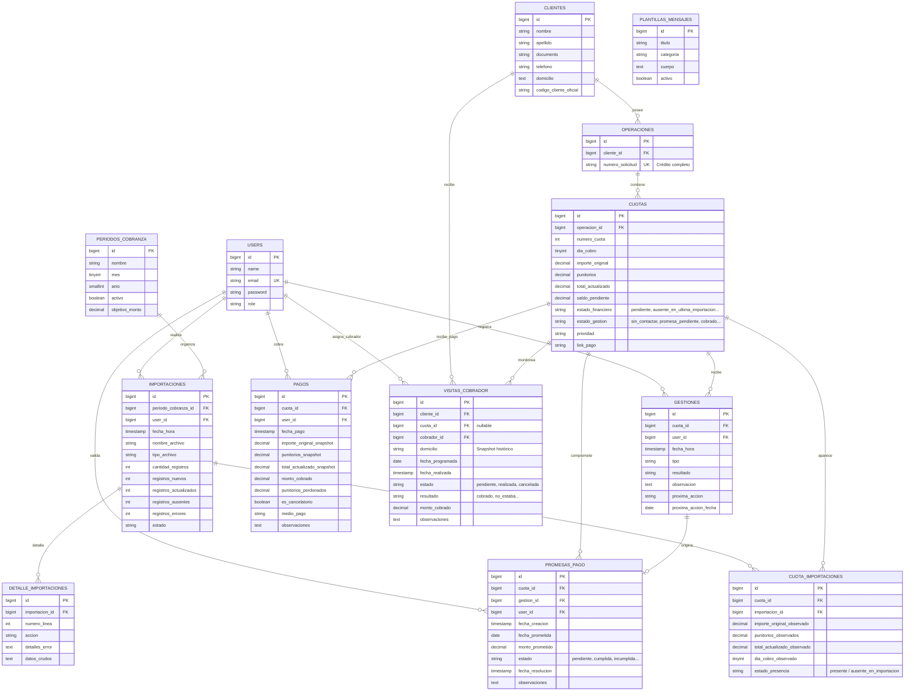

# Diseño del Modelo de Datos — Gestor de Cobranzas

Este documento describe el diseño detallado de la base de datos relacional para el **Gestor de Cobranzas**, estructurado para garantizar la integridad de los datos, la separación clara entre los datos oficiales y los de gestión, un historial de cambios auditable y una sincronización robusta ante importaciones sucesivas de carteras.

---

## 1. Objetivo

El objetivo de este diseño es establecer una estructura de base de datos relacional normalizada y optimizada para la aplicación "Gestor de Cobranzas". Esta base de datos permitirá:
*   Administrar clientes, operaciones (créditos completos) y cuotas sin duplicados.
*   Importar carteras mensuales y realizar sincronizaciones posteriores (detectando registros nuevos, actualizados y ausencias en el archivo de importación posterior sin asumir automáticamente un pago).
*   Garantizar la separación estricta entre la información financiera provista por el sistema oficial y la información de valor agregada por los gestores de la aplicación (los datos internos/manuales no se sobrescriben).
*   Registrar de manera histórica la presencia de cada cuota en las sucesivas importaciones, así como la evolución de sus punitorios oficiales.
*   Mapear con precisión la contabilidad de los pagos (diferenciando importe original, punitorios teóricos, total actualizado, monto efectivamente cobrado, punitorios perdonados y el manejo de pagos parciales).
*   Registrar de manera histórica todas las gestiones de cobranza, promesas de pago, visitas presenciales de cobradores y plantillas de mensajes.
*   Soportar operaciones multiusuario y auditoría básica de cambios.

---

## 2. Entidades y Estructura de Datos

El modelo se compone de las siguientes **13 entidades principales**:

1.  **`users`**: Representa a los usuarios del sistema (administradores, gestores y cobradores) con roles específicos.
2.  **`clientes`**: Información personal y de contacto del cliente (persona física).
3.  **`operaciones`**: Representa el **CRÉDITO COMPLETO** u operación otorgada por la financiera (por ejemplo, "Número de solicitud: 2455"). No pertenece a un periodo mensual específico y se mantiene única para toda la vida del crédito.
4.  **`cuotas`**: Obligaciones individuales dentro de una operación. Su identidad lógica es `operacion_id + numero_cuota` (ej. Solicitud 2455 — Cuota 5). **No** pertenece directamente a un período de cobranza, ya que la cuota mantiene su identidad a lo largo del tiempo si continúa impaga.
5.  **`periodos_cobranza`**: Representa el ciclo mensual de trabajo de cobranza (ej. "Agosto 2026"), sirviendo de base para los objetivos y estadísticas del dashboard.
6.  **`importaciones`**: Registro de auditoría de cada archivo importado por el sistema, asociado a un período de cobranza.
7.  **`cuota_importaciones`**: Entidad de relación que registra la **aparición y estado oficial de una cuota en una importación específica**, conservando los valores oficiales observados en ese momento exacto. Permite reconstruir el historial de punitorios oficiales.
8.  **`detalle_importaciones`**: Registro detallado de nivel de ejecución y auditoría de la importación (ej. errores de validación de filas, acciones de creación, actualización o registro de estado).
9.  **`gestiones`**: Historial de contactos e intentos de comunicación con el cliente para cada cuota.
10. **`promesas_pago`**: Compromisos de pago asumidos por el deudor.
11. **`pagos`**: Registro detallado de cobros e ingresos reales ingresados por los usuarios, con soporte para pagos parciales y condonación de punitorios.
12. **`visitas_cobrador`**: Solicitudes y resultados de las gestiones presenciales/domiciliarias de cobradores.
13. **`plantillas_mensajes`**: Mensajes predefinidos con variables dinámicas para automatizar el contacto con clientes.

---

## 3. Campos Propuestos y Estructura de Tablas

### `users`
Tabla por defecto de Laravel extendida para soportar roles y trazabilidad.

| Campo | Tipo | Nulabilidad | Descripción |
| :--- | :--- | :--- | :--- |
| `id` | BIGINT UNSIGNED | NOT NULL | Clave primaria autoincremental. |
| `name` | VARCHAR(255) | NOT NULL | Nombre y apellido del usuario. |
| `email` | VARCHAR(255) | NOT NULL | Correo electrónico (único). |
| `email_verified_at` | TIMESTAMP | NULL | Fecha de verificación de correo. |
| `password` | VARCHAR(255) | NOT NULL | Contraseña encriptada. |
| `role` | VARCHAR(50) | NOT NULL | Rol del usuario (`administrador`, `gestor`, `cobrador`). |
| `remember_token` | VARCHAR(100) | NULL | Token de sesión de Laravel. |
| `created_at` | TIMESTAMP | NULL | Fecha de creación. |
| `updated_at` | TIMESTAMP | NULL | Fecha de última modificación. |

### `clientes`
Almacena los datos de contacto y de gestión interna del deudor.

| Campo | Tipo | Nulabilidad | Descripción |
| :--- | :--- | :--- | :--- |
| `id` | BIGINT UNSIGNED | NOT NULL | Clave primaria autoincremental. |
| `nombre` | VARCHAR(255) | NOT NULL | Nombre del cliente. |
| `apellido` | VARCHAR(255) | NOT NULL | Apellido del cliente. |
| `documento` | VARCHAR(50) | NULL | DNI, CUIL o pasaporte. Indexado para búsquedas rápidas. |
| `telefono` | VARCHAR(100) | NULL | Número de contacto de gestión (mantenido manualmente, no se destruye por importaciones). |
| `domicilio` | TEXT | NULL | Dirección física de gestión (mantenida manualmente, no se destruye por importaciones). |
| `email` | VARCHAR(255) | NULL | Correo electrónico de contacto secundario. |
| `codigo_cliente_oficial` | VARCHAR(100) | NULL | Código de cliente proveniente del sistema financiero (si existe). |
| `created_at` | TIMESTAMP | NULL | Fecha de creación. |
| `updated_at` | TIMESTAMP | NULL | Fecha de última modificación. |

### `operaciones`
Representa la operación de crédito global única (un único crédito completo).

| Campo | Tipo | Nulabilidad | Descripción |
| :--- | :--- | :--- | :--- |
| `id` | BIGINT UNSIGNED | NOT NULL | Clave primaria autoincremental. |
| `cliente_id` | BIGINT UNSIGNED | NOT NULL | Clave foránea -> `clientes.id`. |
| `numero_solicitud` | VARCHAR(100) | NOT NULL | Identificador único del crédito completo (ej: "2455") en el sistema oficial (Único en DB). |
| `created_at` | TIMESTAMP | NULL | Fecha de creación. |
| `updated_at` | TIMESTAMP | NULL | Fecha de última modificación. |

### `cuotas`
Obligaciones individuales asociadas a una operación de crédito. Su identidad se define por `operacion_id` + `numero_cuota`. No pertenece a un período o importación de manera fija.

| Campo | Tipo | Nulabilidad | Descripción |
| :--- | :--- | :--- | :--- |
| `id` | BIGINT UNSIGNED | NOT NULL | Clave primaria autoincremental. |
| `operacion_id` | BIGINT UNSIGNED | NOT NULL | Clave foránea -> `operaciones.id`. |
| `numero_cuota` | INT | NOT NULL | Número correlativo de cuota (ej: 1, 2, 5, etc.). |
| `dia_cobro` | TINYINT UNSIGNED | NOT NULL | Día sugerido de cobro / sueldo (1 al 31) observado. |
| `importe_original` | DECIMAL(15,2) | NOT NULL | Capital o cuota base del sistema oficial. |
| `punitorios` | DECIMAL(15,2) | NOT NULL | Interés punitorio oficial acumulado según última sincronización. |
| `total_actualizado` | DECIMAL(15,2) | NOT NULL | Sumatoria oficial actual: `importe_original` + `punitorios`. |
| `saldo_pendiente` | DECIMAL(15,2) | NOT NULL | El saldo financiero pendiente neto que el cliente adeuda internamente después de pagos parciales. |
| `estado_financiero`| VARCHAR(50) | NOT NULL | Estado contable de la cuota (`pendiente`, `ausente_en_ultima_importacion`, `pago_realizado_oficial`, `cancelada`). |
| `estado_gestion`    | VARCHAR(50) | NOT NULL | Estado de gestión diario del equipo (`sin_contactar`, `contactado`, `promesa_pendiente`, `promesa_incumplida`, `visita_solicitada`, `seguimiento`, `cobrado`). |
| `prioridad` | VARCHAR(50) | NOT NULL | Prioridad calculada de atención (`critica`, `alta`, `media`, `baja`). |
| `link_pago` | VARCHAR(500) | NULL | URL del botón o enlace de pago electrónico generado. |
| `created_at` | TIMESTAMP | NULL | Fecha de creación. |
| `updated_at` | TIMESTAMP | NULL | Fecha de última modificación. |

### `periodos_cobranza`
Representa el ciclo u objetivo mensual de cobranza.

| Campo | Tipo | Nulabilidad | Descripción |
| :--- | :--- | :--- | :--- |
| `id` | BIGINT UNSIGNED | NOT NULL | Clave primaria autoincremental. |
| `nombre` | VARCHAR(100) | NOT NULL | Nombre del ciclo (ej. "Agosto 2026"). |
| `mes` | TINYINT UNSIGNED | NOT NULL | Número de mes (1 al 12). |
| `anio` | SMALLINT UNSIGNED | NOT NULL | Año del ciclo (ej. 2026). |
| `activo` | BOOLEAN | NOT NULL | Indica si es el periodo corriente de trabajo (`true` o `false`). |
| `objetivo_monto` | DECIMAL(15,2) | NOT NULL | Meta de recaudación en pesos fijada para el mes. |
| `created_at` | TIMESTAMP | NULL | Fecha de creación. |
| `updated_at` | TIMESTAMP | NULL | Fecha de última modificación. |

### `importaciones`
Registro de auditoría de la carga de archivos oficiales, asociada a un periodo de cobranza de trabajo.

| Campo | Tipo | Nulabilidad | Descripción |
| :--- | :--- | :--- | :--- |
| `id` | BIGINT UNSIGNED | NOT NULL | Clave primaria autoincremental. |
| `periodo_cobranza_id` | BIGINT UNSIGNED | NOT NULL | Clave foránea -> `periodos_cobranza.id`. |
| `user_id` | BIGINT UNSIGNED | NULL | Clave foránea -> `users.id` (quién importó). |
| `fecha_hora` | TIMESTAMP | NOT NULL | Fecha y hora en la que se realizó la importación. |
| `nombre_archivo` | VARCHAR(255) | NOT NULL | Nombre del archivo procesado (sin la ruta física interna). |
| `tipo_archivo` | VARCHAR(10) | NOT NULL | Tipo de extensión (`csv`, `xlsx`). |
| `cantidad_registros` | INT | NOT NULL | Total de filas procesadas en el archivo. |
| `registros_nuevos` | INT | NOT NULL | Cantidad de cuotas creadas. |
| `registros_actualizados` | INT | NOT NULL | Cantidad de cuotas cuyos montos oficiales fueron actualizados. |
| `registros_ausentes` | INT | NOT NULL | Cantidad de cuotas ausentes identificadas en esta importación específica. |
| `registros_errores` | INT | NOT NULL | Cantidad de filas con fallos de validación. |
| `estado` | VARCHAR(50) | NOT NULL | Estado final (`procesando`, `completada`, `fallida`). |
| `created_at` | TIMESTAMP | NULL | Fecha de creación. |
| `updated_at` | TIMESTAMP | NULL | Fecha de última modificación. |

### `cuota_importaciones`
Registra la presencia de una cuota en una importación y retiene los valores financieros oficiales observados en ese momento de cara a la evolución histórica de punitorios y auditoría de presencias.

| Campo | Tipo | Nulabilidad | Descripción |
| :--- | :--- | :--- | :--- |
| `id` | BIGINT UNSIGNED | NOT NULL | Clave primaria autoincremental. |
| `cuota_id` | BIGINT UNSIGNED | NOT NULL | Clave foránea -> `cuotas.id`. |
| `importacion_id` | BIGINT UNSIGNED | NOT NULL | Clave foránea -> `importaciones.id`. |
| `importe_original_observado` | DECIMAL(15,2) | NOT NULL | El importe original oficial observado en esta importación. |
| `punitorios_observados` | DECIMAL(15,2) | NOT NULL | El interés punitorio oficial observado en esta importación. |
| `total_actualizado_observado` | DECIMAL(15,2) | NOT NULL | El total oficial observado (`importe_original` + `punitorios`) en este archivo. |
| `dia_cobro_observado` | TINYINT UNSIGNED | NULL | El día de cobro observado en esta importación (si corresponde). |
| `estado_presencia` | VARCHAR(50) | NOT NULL | Indica si la cuota estuvo `'presente'` o `'ausente_en_importacion'` en esta importación particular. |
| `created_at` | TIMESTAMP | NULL | Fecha de creación. |
| `updated_at` | TIMESTAMP | NULL | Fecha de última modificación. |

### `detalle_importaciones`
Bitácora de auditoría detallada a nivel técnico para registrar fallos o acciones de procesamiento de filas individuales de un archivo de importación.

| Campo | Tipo | Nulabilidad | Descripción |
| :--- | :--- | :--- | :--- |
| `id` | BIGINT UNSIGNED | NOT NULL | Clave primaria autoincremental. |
| `importacion_id` | BIGINT UNSIGNED | NOT NULL | Clave foránea -> `importaciones.id`. |
| `numero_linea` | INT | NOT NULL | Número de línea/fila del archivo físico con el problema o acción. |
| `accion` | VARCHAR(50) | NOT NULL | Acción realizada (`creado`, `actualizado_punitorios`, `actualizado_importe`, `marcado_ausente`, `error`). |
| `detalles_error` | TEXT | NULL | Descripción detallada del error si la fila falló en procesarse (ej: formato inválido). |
| `datos_crudos` | TEXT | NULL | JSON con los datos de la fila que causó el error para facilitar el diagnóstico. |
| `created_at` | TIMESTAMP | NULL | Fecha de creación. |

### `gestiones`
Historial cronológico de interacciones de cobranza con el cliente (no se sobrescribe).

| Campo | Tipo | Nulabilidad | Descripción |
| :--- | :--- | :--- | :--- |
| `id` | BIGINT UNSIGNED | NOT NULL | Clave primaria autoincremental. |
| `cuota_id` | BIGINT UNSIGNED | NOT NULL | Clave foránea -> `cuotas.id`. |
| `user_id` | BIGINT UNSIGNED | NOT NULL | Clave foránea -> `users.id` (gestor a cargo). |
| `fecha_hora` | TIMESTAMP | NOT NULL | Momento exacto de la interacción. |
| `tipo` | VARCHAR(50) | NOT NULL | Canal de contacto (ej: `whatsapp_enviado`, `whatsapp_respondido`, `llamada_realizada`, `no_respondio`). |
| `resultado` | VARCHAR(50) | NOT NULL | Consecuencia directa (ej: `no_atendio`, `prometio_pagar`, `solicito_cobrador`, `promesa_incumplida`, `seguimiento`, `cliente_pago`). |
| `observacion` | TEXT | NULL | Comentarios específicos agregados por el gestor. |
| `proxima_accion` | VARCHAR(100) | NULL | Próximo paso planificado (ej: `volver_a_llamar`, `verificar_pago`). |
| `proxima_accion_fecha` | DATE | NULL | Fecha límite en que se debe disparar la próxima acción. |
| `created_at` | TIMESTAMP | NULL | Fecha de creación. |
| `updated_at` | TIMESTAMP | NULL | Fecha de última modificación. |

### `promesas_pago`
Registro histórico de compromisos de pago asumidos por el deudor. Permite evaluar su comportamiento a lo largo del tiempo.

| Campo | Tipo | Nulabilidad | Descripción |
| :--- | :--- | :--- | :--- |
| `id` | BIGINT UNSIGNED | NOT NULL | Clave primaria autoincremental. |
| `cuota_id` | BIGINT UNSIGNED | NOT NULL | Clave foránea -> `cuotas.id`. |
| `gestion_id` | BIGINT UNSIGNED | NULL | Clave foránea -> `gestiones.id` (gestión que generó la promesa). |
| `user_id` | BIGINT UNSIGNED | NOT NULL | Clave foránea -> `users.id` (quién la registró). |
| `fecha_creacion` | TIMESTAMP | NOT NULL | Momento del registro. |
| `fecha_prometida` | DATE | NOT NULL | Fecha límite en la que el cliente se comprometió a pagar. |
| `monto_prometido` | DECIMAL(15,2) | NULL | Monto que se comprometió a abonar. |
| `estado` | VARCHAR(50) | NOT NULL | Estado (`pendiente`, `cumplida`, `incumplida`, `cancelada`). |
| `fecha_resolucion` | TIMESTAMP | NULL | Momento en el que cambió a cumplida, incumplida o cancelada. |
| `observaciones` | TEXT | NULL | Detalles adicionales de la promesa de pago. |
| `created_at` | TIMESTAMP | NULL | Fecha de creación. |
| `updated_at` | TIMESTAMP | NULL | Fecha de última modificación. |

### `pagos`
Contabilidad exacta de ingresos registrados en la aplicación para una cuota. Soporta cobros totales, condonación de intereses y cobros parciales.

| Campo | Tipo | Nulabilidad | Descripción |
| :--- | :--- | :--- | :--- |
| `id` | BIGINT UNSIGNED | NOT NULL | Clave primaria autoincremental. |
| `cuota_id` | BIGINT UNSIGNED | NOT NULL | Clave foránea -> `cuotas.id`. |
| `user_id` | BIGINT UNSIGNED | NOT NULL | Clave foránea -> `users.id` (quién registró el cobro). |
| `fecha_pago` | TIMESTAMP | NOT NULL | Fecha y hora de realización del pago. |
| `importe_original_snapshot` | DECIMAL(15,2) | NOT NULL | Captura del `importe_original` oficial de la cuota al momento del pago. |
| `punitorios_snapshot` | DECIMAL(15,2) | NOT NULL | Captura de los `punitorios` oficiales acumulados al momento. |
| `total_actualizado_snapshot` | DECIMAL(15,2) | NOT NULL | Captura de la deuda oficial de la cuota al momento del pago. |
| `monto_cobrado` | DECIMAL(15,2) | NOT NULL | Monto efectivamente recibido de este deudor. |
| `punitorios_perdonados` | DECIMAL(15,2) | NOT NULL | Interés perdonado (condonación explícita) registrado en esta transacción. |
| `es_cancelatorio` | BOOLEAN | NOT NULL | Indica si el pago liquida definitivamente la cuota (`true`) o es un pago parcial (`false`). |
| `medio_pago` | VARCHAR(50) | NOT NULL | Método de ingreso (`efectivo`, `transferencia`, `cobrador`, `tarjeta`). |
| `observaciones` | TEXT | NULL | Notas de auditoría, recibo o comprobante de la transacción. |
| `created_at` | TIMESTAMP | NULL | Fecha de creación. |
| `updated_at` | TIMESTAMP | NULL | Fecha de última modificación. |

### `visitas_cobrador`
Registro de visitas presenciales. La relación con la cuota es opcional para soportar visitas preventivas "al día" o globales por cliente.

| Campo | Tipo | Nulabilidad | Descripción |
| :--- | :--- | :--- | :--- |
| `id` | BIGINT UNSIGNED | NOT NULL | Clave primaria autoincremental. |
| `cliente_id` | BIGINT UNSIGNED | NOT NULL | Clave foránea -> `clientes.id`. |
| `cuota_id` | BIGINT UNSIGNED | NULL | Clave foránea -> `cuotas.id` (opcional si la visita cubre múltiples deudas o si el cliente está al día). |
| `cobrador_id` | BIGINT UNSIGNED | NOT NULL | Clave foránea -> `users.id` (con rol cobrador). |
| `domicilio` | VARCHAR(255) | NOT NULL | Domicilio visitado (snapshot histórico congelado al crear la visita, protege de cambios posteriores del cliente). |
| `fecha_programada` | DATE | NOT NULL | Día planificado para la visita. |
| `fecha_realizada` | TIMESTAMP | NULL | Momento exacto en que se concretó la visita física. |
| `estado` | VARCHAR(50) | NOT NULL | Estado de la hoja de ruta (`pendiente`, `realizada`, `cancelada`). |
| `resultado` | VARCHAR(50) | NULL | Clasificación del resultado de la visita (`cobrado`, `cobrado_parcialmente`, `no_estaba`, `no_se_pudo_contactar`, `reprogramar`, `se_nego_a_pagar`, `domicilio_incorrecto`). |
| `monto_cobrado` | DECIMAL(15,2) | NOT NULL | Monto cobrado en efectivo por el cobrador en el lugar (por defecto `0.00`). |
| `observaciones` | TEXT | NULL | Comentarios o notas de campo de la visita. |
| `created_at` | TIMESTAMP | NULL | Fecha de creación. |
| `updated_at` | TIMESTAMP | NULL | Fecha de última modificación. |

### `plantillas_mensajes`
Mensajes rápidos para contacto.

| Campo | Tipo | Nulabilidad | Descripción |
| :--- | :--- | :--- | :--- |
| `id` | BIGINT UNSIGNED | NOT NULL | Clave primaria autoincremental. |
| `titulo` | VARCHAR(100) | NOT NULL | Identificador interno (ej: "Aviso Vence Hoy"). |
| `categoria` | VARCHAR(50) | NOT NULL | Categoría del mensaje (`proximo_vencimiento`, `vence_hoy`, `cuota_vencida`, `link_pago`, `promesa_pago`, `seguimiento_promesa`, `cobrador`, `sin_respuesta`). |
| `cuerpo` | TEXT | NOT NULL | Texto parametrizado con etiquetas dinámicas (ej: `{nombre}`, `{importe}`, `{numero_cuota}`, `{link_pago}`). |
| `activo` | BOOLEAN | NOT NULL | Permite inhabilitar plantillas en desuso (`true` o `false`). |
| `created_at` | TIMESTAMP | NULL | Fecha de creación. |
| `updated_at` | TIMESTAMP | NULL | Fecha de última modificación. |

---

## 4. Diagrama Entidad-Relación (Mermaid)

El siguiente diagrama detalla cómo interactúan las nuevas entidades y la reestructuración del modelo de datos:

---

## 5. Índices Recomendados

Para garantizar un excelente desempeño bajo grandes volúmenes de carteras, se sugieren los siguientes índices:

1.  **`clientes (documento)`**: Búsquedas inmediatas de clientes por DNI/CUIL.
2.  **`clientes (codigo_cliente_oficial)`**: Vinculación rápida desde planillas de carteras.
3.  **`operaciones (numero_solicitud)`**: Índice único para evitar duplicados del crédito completo.
4.  **`cuotas (operacion_id, numero_cuota)`**: Compuesto y ÚNICO. Bloquea duplicidades lógicas de cuota de forma estricta.
5.  **`cuotas (estado_financiero)`** y **`cuotas (estado_gestion)`**: Acelera los filtros en tableros y agendas.
6.  **`cuotas (prioridad)`**: Ordenación del dashboard según la prioridad calculada o guardada.
7.  **`periodos_cobranza (anio, mes)`**: Único, impide duplicación de períodos mensuales.
8.  **`cuota_importaciones (cuota_id, importacion_id)`**: Compuesto y ÚNICO. Evita múltiples registros de aparición de una cuota en la misma importación.
9.  **`gestiones (cuota_id, fecha_hora)`**: Para renderizar la línea de tiempo histórica del cliente rápidamente.
10. **`promesas_pago (fecha_prometida, estado)`**: Crítico para buscar las promesas diarias pendientes.
11. **`visitas_cobrador (cobrador_id, fecha_programada, estado)`**: Creación de hojas de ruta de cobradores.

---

## 6. Restricciones Únicas de Base de Datos

*   **`users.email`**: Único.
*   **`operaciones.numero_solicitud`**: Único a nivel global de la base de datos.
*   **`cuotas` (Compuesta: `operacion_id`, `numero_cuota`)**: Única. Garantiza que solo exista una Cuota N para la Operación X.
*   **`cuota_importaciones` (Compuesta: `cuota_id`, `importacion_id`)**: Única. Impide duplicados de presencia de cuota en el mismo archivo procesado.
*   **`periodos_cobranza` (Compuesta: `anio`, `mes`)**: Único. Evita la coexistencia de múltiples periodos de cobranza activos duplicados para un mismo mes del calendario.

---

## 7. Reglas de Integridad Referencial

*   **`ON DELETE RESTRICT`**:
    *   No se puede eliminar un `cliente` si tiene `operaciones` vigentes.
    *   No se puede eliminar una `operacion` si tiene `cuotas` asociadas.
    *   No se puede borrar un `periodo_cobranza` si ya posee `importaciones` cargadas.
    *   No se puede eliminar un `usuario` si tiene registros asociados en `gestiones`, `promesas_pago`, `pagos` o `visitas_cobrador` para preservar la auditoría y trazabilidad del trabajo del empleado.
*   **`ON DELETE CASCADE`**:
    *   `cuota_importaciones` y `detalle_importaciones` se eliminarán en cascada únicamente si la cabecera `importaciones` es eliminada de manera intencionada por depuración técnica de carteras.
*   **`Soft Deletes` (Bajas lógicas)**:
    *   **No** se utilizará Soft Deletes para entidades contables y financieras críticas (`cuotas`, `pagos`, `operaciones`, `clientes`), ya que un registro ausente en la planilla oficial debe cambiar de **estado financiero** lógicamente (ej: `'ausente_en_importacion'`), pero **nunca ser ocultado físicamente** mediante soft deletes, lo que falsearía la historia de auditoría de las gestiones.

---

## 8. Estrategia de Sincronización (Importaciones Posteriores)

La sincronización mensual o periódica de carteras es el proceso principal del sistema. Funciona bajo las siguientes premisas:

1.  **Lectura del Archivo (PhpSpreadsheet)**:
    Se procesa el archivo provisto. Por cada fila, se extraen los campos oficiales: `numero_solicitud`, `numero_cuota`, `nombre`, `apellido`, `dni`/`documento`, `dia_cobro`, `importe_original` y `punitorios`.
2.  **Identificación y Matching del Cliente**:
    *   Se busca en `clientes` con prioridad:
        1. Código único oficial de cliente (`codigo_cliente_oficial`), si se provee.
        2. Número de documento (`documento`), si existe y es confiable.
        3. En caso de no existir o no ser confiables, el sistema registra una coincidencia potencial por `nombre + apellido` como última opción interna, pero **no asume unicidad artificial rígida** para evitar riesgos de homonimia. Si no se puede identificar unívocamente, se crea un nuevo cliente.
3.  **Identificación y Matching de la Operación (Crédito Completo)**:
    *   Se busca en `operaciones` por `numero_solicitud` (ej. "2455").
    *   Si no existe, se crea vinculada al cliente identificado en el paso anterior.
4.  **Procesamiento de la Cuota**:
    *   Se busca en `cuotas` utilizando la combinación `(operacion_id, numero_cuota)`.
    *   **Caso A (Cuota Nueva)**: Si no se encuentra, se crea la cuota con estado financiero inicial `'pendiente'`, estado de gestión `'sin_contactar'`, y `saldo_pendiente = importe_original + punitorios`.
    *   **Caso B (Cuota Existente)**: Si ya existe en la base de datos, el sistema **solo actualiza los datos oficiales financieros**:
        *   Nuevos valores de `punitorios`.
        *   Nuevo valor de `total_actualizado` (`importe_original` + `punitorios`).
        *   Se recalcula el `saldo_pendiente` si no tiene pagos registrados.
        *   **Regla de Oro**: No se destruye ni sobrescribe información de gestión propia (`telefono`, `domicilio`, `estado_gestion`, `observaciones`, `gestiones`, `promesas`, `pagos`, `visitas_cobrador` o prioridad manual).
5.  **Registro de Aparición**:
    *   Por cada cuota procesada en la importación actual (sea nueva o preexistente), se inserta un registro en la tabla **`cuota_importaciones`** con `estado_presencia = 'presente'`, guardando los valores observados exactos de esa fecha. Esto construye el **Historial de Punitorios**.
6.  **Identificación de Cuotas Ausentes ("Ausente" !== "Pagado")**:
    *   Una vez leídas todas las filas del archivo de importación, el sistema busca las cuotas que estaban activas en la base de datos antes de importar, pero que **no se incluyeron en el nuevo archivo**.
    *   **Acción del Sistema**:
        *   No se asume de manera automática que el cliente pagó ni se registra un pago.
        *   No se borra la cuota de la base de datos para preservar todo su historial.
        *   Se cambia su `estado_financiero` a **`'ausente_en_ultima_importacion'`**.
        *   Se inserta un registro de aparición en **`cuota_importaciones`** con `estado_presencia = 'ausente_en_importacion'`.
        *   De esta manera, los gestores de la aplicación pueden ver visualmente la ausencia y confirmar de forma manual qué ocurrió antes de archivarla o registrar el pago correspondiente.

---

## 9. Ejemplo Obligatorio de Sincronización y Evolución

### Paso 1: Importación Inicial — 01/08
Archivo importado:
*   Solicitud 2455 — Cuota 5 (Importe: $100.000, Punitorios: $2.000)
*   Solicitud 3000 — Cuota 2 (Importe: $80.000, Punitorios: $1.000)
*   Solicitud 4100 — Cuota 8 (Importe: $150.000, Punitorios: $3.000)

**Resultado en la Base de Datos:**
*   Se crean las operaciones `2455`, `3000` y `4100` en la tabla `operaciones` (si no existían).
*   Se crean 3 cuotas en `cuotas`:
    *   Cuota `2455/5` con `importe_original = 100000.00`, `punitorios = 2000.00`, `total_actualizado = 102000.00`, `estado_financiero = 'pendiente'`.
    *   Cuota `3000/2` con `importe_original = 80000.00`, `punitorios = 1000.00`, `total_actualizado = 81000.00`, `estado_financiero = 'pendiente'`.
    *   Cuota `4100/8` con `importe_original = 150000.00`, `punitorios = 3000.00`, `total_actualizado = 153000.00`, `estado_financiero = 'pendiente'`.
*   Se crean 3 registros de presencia en `cuota_importaciones` asociados a esta importación inicial con los respectivos valores oficiales iniciales.

### Paso 2: Segunda Importación — 10/08
Archivo importado (la Solicitud 2455 — Cuota 5 ya no aparece):
*   Solicitud 3000 — Cuota 2 (Importe: $80.000, Punitorios: $2.500)  *(Punitorios aumentaron)*
*   Solicitud 4100 — Cuota 8 (Importe: $150.000, Punitorios: $4.500)  *(Punitorios aumentaron)*

**Resultado en la Base de Datos:**
*   Las cuotas `3000/2` y `4100/8` se actualizan en `cuotas` con sus nuevos punitorios ($2.500 y $4.500).
*   Se insertan nuevos registros en `cuota_importaciones` reflejando su presencia en esta segunda importación con los nuevos punitorios actualizados.
*   La cuota **`2455/5` no se elimina, no se duplica ni se registra un pago automático**.
*   El `estado_financiero` de la cuota `2455/5` cambia a **`'ausente_en_ultima_importacion'`**.
*   Se inserta un registro en `cuota_importaciones` para la cuota `2455/5` con `estado_presencia = 'ausente_en_importacion'`. Su historial completo de gestiones, llamadas, promesas y visitas permanece intacto en el sistema.

### Paso 3: Tercera Importación — 20/08 (Reaparición de la Cuota)
Archivo importado (la Solicitud 2455 — Cuota 5 vuelve a aparecer con punitorios más altos):
*   Solicitud 2455 — Cuota 5 (Importe: $100.000, Punitorios: $5.000)
*   Solicitud 3000 — Cuota 2 (Importe: $80.000, Punitorios: $3.500)
*   Solicitud 4100 — Cuota 8 (Importe: $150.000, Punitorios: $6.000)

**Resultado en la Base de Datos:**
*   El sistema reconoce que `2455` + cuota `5` ya existe en la base de datos. **No crea una nueva cuota ni una nueva operación**.
*   Actualiza los punitorios de la cuota preexistente `2455/5` a $5.000 y cambia su `estado_financiero` de vuelta a `'pendiente'`.
*   Registra una nueva aparición en `cuota_importaciones` para esta importación del 20/08, reflejando el nuevo valor oficial observado de punitorios ($5.000).

### Paso 4: Avance Normal del Crédito
Supongamos que el deudor cancela la cuota 5 y avanza normalmente con el crédito de la operación.
En la cartera del mes siguiente, el archivo oficial contiene:
*   Solicitud 2455 — Cuota 6 (Importe: $100.000, Punitorios: $0)

**Resultado en la Base de Datos:**
*   El sistema identifica que la operación `2455` ya existe. **No se crea una nueva operación 2455**.
*   Se crea la cuota número `6` vinculada a la operación `2455` preexistente.
*   La operación `2455` ahora contiene en su historial tanto la cuota `5` como la cuota `6` con su respectivo historial independiente.

---

## 10. Gestión Contable de Pagos

El sistema independiza el monto teórico adeudado del cobro real recibido y permite registrar tres flujos principales con precisión:

### 10.1 Pago Completo sin Condonación (Con Punitorios)
*   **Ejemplo:**
    *   Importe original de cuota: $100.000
    *   Punitorios oficiales: $2.000
    *   Total actualizado oficial: $102.000
    *   Monto cobrado: $102.000
    *   Punitorios perdonados: $0
*   **Comportamiento:** Se registra el pago en `pagos` por $102.000. El `saldo_pendiente` de la cuota cambia a $0 y el `estado_gestion` pasa a `'cobrado'`. El `estado_financiero` se actualiza a `'pago_realizado_oficial'` (o `'pago_realizado_app'`).

### 10.2 Pago Completo con Punitorios Perdonados (Condonación de Intereses)
*   **Ejemplo:**
    *   Importe original de cuota: $100.000
    *   Punitorios oficiales: $2.000
    *   Total actualizado oficial: $102.000
    *   Monto cobrado: $100.000
    *   Punitorios perdonados: $2.000
*   **Comportamiento:** El usuario registra el ingreso de $100.000 e indica de manera explícita que se perdonaron los $2.000 de punitorios. El `saldo_pendiente` de la cuota cambia a $0, el `estado_gestion` pasa a `'cobrado'`, y los intereses condonados quedan archivados de manera exacta en `pagos.punitorios_perdonados` para reportes.

### 10.3 Pagos Parciales (Entregas a Cuenta)
*   **Ejemplo:**
    *   Importe original de cuota: $100.000
    *   Punitorios oficiales: $2.000
    *   Deuda total: $102.000
    *   Monto cobrado (entrega a cuenta): $50.000
*   **Comportamiento:**
    *   Se registra el pago parcial de $50.000 en la tabla `pagos` con `es_cancelatorio = false` y `punitorios_perdonados = 0.00`.
    *   **Regla Contable:** **No** se asume que los $52.000 restantes son "punitorios perdonados".
    *   El `saldo_pendiente` de la cuota se reduce a $52.000 (`$102.000 - $50.000`).
    *   El `estado_gestion` cambia a `'seguimiento'` o se mantiene en gestión de saldo pendiente.
    *   Los punitorios perdonados solo se calcularán y registrarán si en el pago final (cancelatorio) se decide perdonar el saldo restante de intereses.

---

## 11. Datos Oficiales vs. Datos Internos de Gestión

Para asegurar la inmutabilidad y la seguridad operativa de la herramienta, se establece una división estricta de responsabilidades sobre los campos del sistema:

### Datos Oficiales (De Solo Lectura por el Importador)
Estos campos provienen directamente del sistema oficial de la financiera. **El importador puede crearlos y actualizarlos**, pero ningún usuario puede modificarlos manualmente de manera directa en la aplicación para evitar discrepancias financieras:
*   `operaciones.numero_solicitud`
*   `cuotas.numero_cuota`
*   `cuotas.importe_original`
*   `cuotas.punitorios`
*   `cuotas.total_actualizado`
*   `cuotas.dia_cobro`
*   `cuota_importaciones.*` (Valores observados oficiales)

### Datos Internos y de Gestión (De Escritura Exclusiva de la Aplicación)
Estos campos pertenecen al valor agregado por el equipo de cobranzas y la lógica de negocio diaria. **El importador de carteras nunca los destruirá, vaciará ni sobrescribirá** durante sincronizaciones posteriores:
*   `clientes.telefono` (Permite corregir o agregar números válidos detectados).
*   `clientes.domicilio` (Permite actualizar la dirección de gestión del deudor).
*   `clientes.email`
*   `cuotas.saldo_pendiente` (Calculado y modificado por el registro de pagos parciales en la app).
*   `cuotas.estado_gestion` (Controlado por las interacciones y acciones del gestor).
*   `cuotas.prioridad` (Calculado dinámicamente o ajustado manualmente por el equipo).
*   `cuotas.link_pago`
*   `gestiones.*` (Historial de contactos intocable).
*   `promesas_pago.*` (Historial de compromisos de pago intocable).
*   `pagos.*` (Historial de ingresos de caja intocable).
*   `visitas_cobrador.*` (Planificación y campo congelado de visitas intocable).

---

## 12. Decisiones Técnicas y de Negocio

A continuación se fundamentan las decisiones operativas tomadas para este diseño:

### 12.1 Separación Estricta de Estados en la Cuota
*   **Decisión:** Eliminar `cuotas.estado` y reemplazarlo por dos columnas diferenciadas: `estado_financiero` y `estado_gestion`.
*   **Justificación:** Un deudor puede tener una promesa de pago vigente (estado de gestión interna) mientras que oficialmente su cuota sigue estando `'pendiente'` (estado financiero oficial). Al separarlos, evitamos colisiones y permitimos que un archivo de importación posterior actualice los aspectos oficiales sin alterar la fase de negociación interna del gestor.

### 12.2 Coexistencia de `cuota_importaciones` y `detalle_importaciones`
*   **Decisión:** Mantener ambas tablas con propósitos claramente diferenciados.
*   **Justificación:**
    *   **`cuota_importaciones`**: Es una entidad transaccional de negocio que registra los datos financieros de presencia oficiales observados. Sirve para construir el gráfico de la evolución histórica de punitorios y verificar la asistencia de una cuota en la cartera de un día específico.
    *   **`detalle_importaciones`**: Es un log técnico de ejecución del importador. Guarda los errores de validación, fallos de lectura, líneas con formatos inválidos y bitácora de auditoría detallada que no tiene valor relacional directo para la gestión cotidiana pero sí para el soporte técnico.

### 12.3 Prioridad de Cuota: Almacenada con Recálculo Semidinámico
*   **Decisión:** El campo `cuotas.prioridad` se almacena físicamente en la tabla de base de datos para facilitar búsquedas y ordenamientos rápidos en listados masivos de clientes, pero se recalcula de forma semidinámica a través de eventos de la aplicación (ej: al registrar una promesa incumplida, al pasar un cliente a estado `'sin_respuesta'`, o mediante un comando programado nocturno que evalúe los días de mora).

---

## 13. Decisiones Pendientes de Confirmación (REQUIRES REVIEW)

Las siguientes propuestas de diseño tocan políticas comerciales y operativas y deben ser confirmadas por el usuario antes de comenzar con la etapa física de migraciones:

1.  **`REQUIRES REVIEW` — Límites de Condonación para Perfiles de Cobradores**:
    ¿Cualquier gestor o cobrador de calle tiene la atribución operativa para perdonar punitorios de manera ilimitada en el sistema, o deberíamos diseñar un campo de "Límite de Condonación Autorizado" según el rol (`gestor`, `cobrador`) en la tabla `users`?
2.  **`REQUIRES REVIEW` — Domicilio del Cliente vs. Domicilio de Visita**:
    Se ha definido que la tabla `visitas_cobrador` guarda una copia en texto plano del `domicilio` al momento de programar la visita. Esto congela la historia ("se lo visitó en esa dirección"). ¿Es suficiente con esta inmutabilidad, o se preve la necesidad de manejar múltiples domicilios activos simultáneos por cliente?
3.  **`REQUIRES REVIEW` — Validación de Carteras sin Documento Único**:
    En caso de que las planillas de la financiera no cuenten de manera obligatoria con DNI/CUIL, se propone que el sistema de matching recurra a `nombre + apellido` como último recurso de vinculación. ¿Existe la posibilidad de que la empresa garantice un campo único por cliente (código de cliente o documento) para eliminar los fallos por nombres homónimos?
